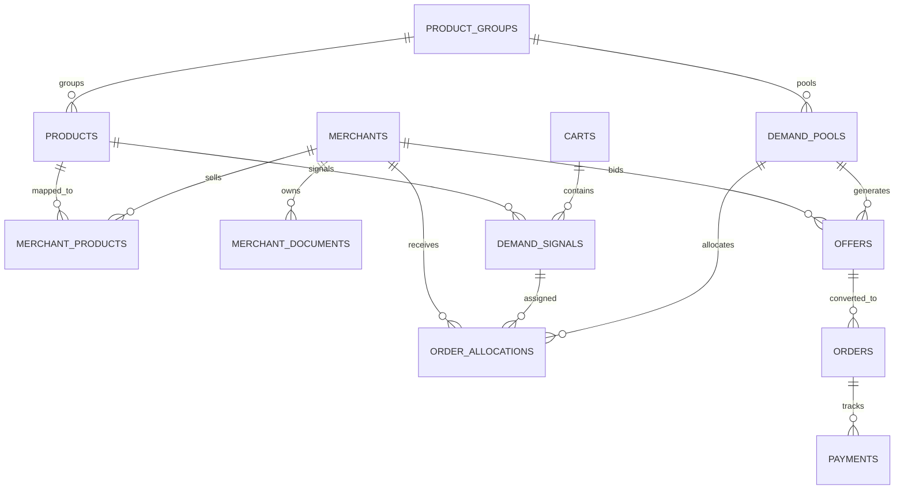

# Project Flow — API Reference Documentation

**Project Flow** is a multi-vendor agentic demand-recovery marketplace on Shopify. It intercepts cart abandonments, aggregates consumer demand into pools, leverages a 2-step LLM pipeline (DeepSeek strategy + Qwen/Gemini RAG composer) to generate merchant offers, assigns customers via a fair Section 9A.2 round-robin allocation engine, and converts sales via Razorpay payment links and automated Shopify fulfillment order creation.

---

## Table of Contents

- [Overview & Architecture](#overview--architecture)
- [Base URL & Interactive Docs](#base-url--interactive-docs)
- [Authentication & Webhook Security](#authentication--webhook-security)
- [Standard Error Responses](#standard-error-responses)
- [API Endpoints Summary](#api-endpoints-summary)
- [Endpoint Details](#endpoint-details)
  - [1. Health Check](#1-health-check)
  - [2. Products](#2-products)
  - [3. Product Groups](#3-product-groups)
  - [4. Merchants](#4-merchants)
  - [5. Merchant Onboarding & Product Linking](#5-merchant-onboarding--product-linking)
  - [6. Merchant Documents (RAG Knowledge Base)](#6-merchant-documents-rag-knowledge-base)
  - [7. Demand Pools & Signals](#7-demand-pools--signals)
  - [8. Offer Generation & Fair Allocation](#8-offer-generation--fair-allocation)
  - [9. Offers & Selection](#9-offers--selection)
  - [10. Orders](#10-orders)
  - [11. Payments](#11-payments)
  - [12. Shopify Proxy](#12-shopify-proxy)
  - [13. Webhooks (Shopify & Razorpay)](#13-webhooks-shopify--razorpay)
- [Data Models Reference](#data-models-reference)

---

## Overview & Architecture

```
[Shopify Storefront]
         │ (checkouts/create webhook)
         ▼
[Carts & Demand Signals] ──(Abandonment Scheduler)──► [Demand Pools]
                                                           │
                                                           ▼
[Merchant RAG Knowledge] ──► [2-Step LLM Engine] ──► [Validated Offers]
(Docs, Stock, Margin Floor)   (DeepSeek + Qwen/Gemini)     │
                                                           ▼
                                               [Section 9A.2 Allocation]
                                               (Round-Robin / Winner)
                                                           │
                                                           ▼
[Customer Offer Select] ◄────────────────────── [Candidate Offers]
         │
         ▼
[Razorpay Payment Link Created]
         │
         ▼
[Razorpay Webhook (payment_link.paid)] ──► [Auto-Create Shopify Order]
```

---

## Base URL & Interactive Docs

- **Local Base URL**: `http://localhost:8000`
- **Interactive Swagger UI**: [http://localhost:8000/docs](http://localhost:8000/docs)
- **Interactive ReDoc**: [http://localhost:8000/redoc](http://localhost:8000/redoc)
- **OpenAPI JSON**: [http://localhost:8000/openapi.json](http://localhost:8000/openapi.json)

---

## Authentication & Webhook Security

1. **Standard REST Endpoints**: Open for local microservice/frontend communication (CORS enabled for all origins by default in local dev).
2. **Shopify Webhooks**: Verified using `HMAC-SHA256` digest in header `X-Shopify-Hmac-Sha256` matching `SHOPIFY_WEBHOOK_SECRET`.
3. **Razorpay Webhooks**: Verified using HMAC signature in header `X-Razorpay-Signature` matching `RAZORPAY_WEBHOOK_SECRET`.

---

## Standard Error Responses

Project Flow returns standard HTTP error codes with a JSON error payload:

```json
{
  "detail": "Product not found"
}
```

| Status Code | Meaning | Typical Scenario |
|:---|:---|:---|
| `200 OK` | Success | Standard read/update response |
| `201 Created` | Created | Resource created |
| `400 Bad Request` | Validation / Logic Error | Missing payload fields, invalid offer state |
| `401 Unauthorized` | Signature Verification Failed | Invalid HMAC header on webhooks |
| `403 Forbidden` | Access Prohibited | Offer not allocated to requested customer |
| `404 Not Found` | Not Found | Resource ID does not exist |
| `500 Internal Server Error` | Server Exception | Processing or external provider failure |
| `502 Bad Gateway` | Upstream Failure | Shopify Admin API or Razorpay API outage |

---

## API Endpoints Summary

| Method | Endpoint | Description |
|---|---|---|
| `GET` | `/health` | Server health check |
| `GET` | `/products` | List all catalog products |
| `POST` | `/products` | Create a new catalog product |
| `GET` | `/products/{product_id}` | Retrieve a specific product |
| `GET` | `/product-groups` | List canonical product groups |
| `POST` | `/product-groups` | Create a canonical product group |
| `GET` | `/product-groups/{group_id}/merchants` | List merchants linked to a group |
| `GET` | `/merchants` | List all onboarded merchants |
| `POST` | `/merchants` | Register a new merchant |
| `PATCH` | `/merchants/{merchant_id}` | Update merchant configuration / inventory |
| `POST` | `/merchants/onboard` | Onboarding endpoint for merchant signup |
| `GET` | `/merchants/{merchant_id}/shopify-products` | Fetch raw Shopify products for vendor |
| `POST` | `/merchants/{merchant_id}/link-products` | Link Shopify products & sync metafields |
| `POST` | `/merchants/{merchant_id}/documents` | Upload PDF/DOCX/TXT for merchant RAG |
| `GET` | `/merchants/{merchant_id}/documents` | List uploaded merchant documents |
| `GET` | `/demand-pools` | List all demand pools |
| `GET` | `/demand-pools/{pool_id}` | Retrieve a specific demand pool |
| `GET` | `/demand-pools/{pool_id}/eligible-merchants` | Resolve eligible bidding merchants |
| `GET` | `/demand-pools/{pool_id}/selected-merchants` | Resolve Section 9A selected merchants |
| `POST` | `/demand-pools/{pool_id}/generate-offers` | Trigger 2-step LLM offer engine & 9A.2 allocation |
| `GET` | `/demand-pools/{pool_id}/allocations` | View 9A.2 round-robin customer allocations |
| `GET` | `/offers` | List offers (filter by pool/status) |
| `GET` | `/offers/{offer_id}` | Retrieve specific offer |
| `POST` | `/offers/{offer_id}/select` | Customer selects offer; generates Razorpay link |
| `GET` | `/orders/{order_id}` | Retrieve order status |
| `GET` | `/payments/{payment_id}` | Retrieve payment status |
| `GET` | `/shopify/vendors` | List distinct vendor names from Shopify |
| `POST` | `/webhooks/shopify/checkout-create` | Ingest Shopify checkout & create demand signals |
| `POST` | `/webhooks/shopify/order-create` | Convert cart when purchased in Shopify |
| `POST` | `/webhooks/razorpay/payment-link-paid` | Payment webhook; auto-fulfills Shopify order |

---

## Endpoint Details

### 1. Health Check

#### `GET /health`
Verifies backend liveness.

- **Response `200 OK`**:
```json
{
  "status": "ok"
}
```

---

### 2. Products

#### `GET /products`
List products with pagination.

- **Query Parameters**:
  - `limit` (*integer*, optional, default: `100`): Maximum rows to return.
  - `offset` (*integer*, optional, default: `0`): Rows to skip.
- **Response `200 OK`**:
```json
[
  {
    "id": "e932454b-d7d8-4f81-9b48-18e404b8ce27",
    "shopify_product_id": "gid://shopify/Product/84920491",
    "title": "Sony WH-1000XM5 Wireless Headphones",
    "price": 29990.00,
    "sku": "SONY-XM5-BLK",
    "vendor": "AudioHub India",
    "category": "Electronics",
    "product_group_id": "a50c8bc4-a6c6-43c2-a4a3-481d6833b91a",
    "raw_shopify_data": { "tags": ["bluetooth", "anc"] },
    "created_at": "2026-08-29T10:00:00Z",
    "updated_at": "2026-08-29T10:00:00Z"
  }
]
```

#### `POST /products`
Create a new product.

- **Request Body**:
```json
{
  "shopify_product_id": "gid://shopify/Product/84920491",
  "title": "Sony WH-1000XM5 Wireless Headphones",
  "price": 29990.00,
  "sku": "SONY-XM5-BLK",
  "vendor": "AudioHub India",
  "category": "Electronics",
  "product_group_id": "a50c8bc4-a6c6-43c2-a4a3-481d6833b91a",
  "raw_shopify_data": {}
}
```
- **Response `201 Created`**: Returns the created `ProductRead` object.

#### `GET /products/{product_id}`
Retrieve a single product by UUID.

- **Path Parameters**:
  - `product_id` (*UUID*, required): Product UUID.
- **Response `200 OK`**: Single `ProductRead` object.
- **Response `404 Not Found`**: `{"detail": "Product not found"}`

---

### 3. Product Groups

Product groups represent canonical SKU/model groupings across multiple Shopify vendor listings.

#### `GET /product-groups`
List all product groups.

- **Query Parameters**:
  - `limit` (*integer*, optional, default: `100`)
  - `offset` (*integer*, optional, default: `0`)
- **Response `200 OK`**:
```json
[
  {
    "id": "a50c8bc4-a6c6-43c2-a4a3-481d6833b91a",
    "canonical_sku": "SONY-XM5",
    "model_name": "Sony WH-1000XM5",
    "created_at": "2026-08-29T08:00:00Z"
  }
]
```

#### `POST /product-groups`
Create a canonical product group.

- **Request Body**:
```json
{
  "canonical_sku": "SONY-XM5",
  "model_name": "Sony WH-1000XM5"
}
```
- **Response `201 Created`**: `ProductGroupRead` object.

#### `GET /product-groups/{group_id}/merchants`
Returns all competing merchants offering items mapped to this product group.

- **Path Parameters**:
  - `group_id` (*UUID*, required): Group UUID.
- **Response `200 OK`**:
```json
[
  {
    "merchant_id": "5f8a0026-68b4-4b53-b09e-31da64a66a1f",
    "name": "AudioHub India",
    "shopify_vendor_name": "AudioHub India",
    "margin_floor_pct": 12.5,
    "stock_data": { "available_qty": 45 },
    "accessory_inventory": { "case": 20, "cable": 50 },
    "warranty_cost_data": { "1yr_extended": 499 },
    "is_active": true
  }
]
```

---

### 4. Merchants

#### `GET /merchants`
List onboarded merchants.

- **Query Parameters**: `limit` (default: 100), `offset` (default: 0)
- **Response `200 OK`**:
```json
[
  {
    "id": "5f8a0026-68b4-4b53-b09e-31da64a66a1f",
    "name": "AudioHub India",
    "shopify_vendor_name": "AudioHub India",
    "margin_floor_pct": 12.5,
    "stock_data": { "available_qty": 45 },
    "accessory_inventory": { "premium_case": 30 },
    "warranty_cost_data": { "cost_inr": 350 },
    "is_active": true,
    "created_at": "2026-08-29T07:30:00Z"
  }
]
```

#### `POST /merchants`
Register a merchant manually.

- **Request Body**:
```json
{
  "name": "SoundWave Retail",
  "shopify_vendor_name": "SoundWave",
  "margin_floor_pct": 15.0,
  "stock_data": { "available_qty": 20 },
  "accessory_inventory": { "leather_pouch": 15 },
  "warranty_cost_data": { "cost_inr": 400 },
  "is_active": true
}
```
- **Response `201 Created`**: `MerchantRead` object.

#### `PATCH /merchants/{merchant_id}`
Partial update of merchant parameters (e.g. stock, margin floor, active flag).

- **Request Body** (all fields optional):
```json
{
  "margin_floor_pct": 10.0,
  "stock_data": { "available_qty": 18 },
  "is_active": true
}
```
- **Response `200 OK`**: Updated `MerchantRead` object.

---

### 5. Merchant Onboarding & Product Linking

#### `POST /merchants/onboard`
Merchant self-signup endpoint.

- **Request Body**:
```json
{
  "name": "Apex Electronics",
  "shopify_vendor_name": "Apex Electronics",
  "margin_floor_pct": 14.0
}
```
- **Response `201 Created`**:
```json
{
  "id": "7fa490c2-3e28-444a-a6ea-cfcb7e254e20",
  "name": "Apex Electronics",
  "shopify_vendor_name": "Apex Electronics",
  "margin_floor_pct": 14.0,
  "is_active": true,
  "created_at": "2026-08-29T10:15:00Z"
}
```

#### `GET /merchants/{merchant_id}/shopify-products`
Fetches all products from Shopify Admin matching the merchant's `shopify_vendor_name`.

- **Response `200 OK`**:
```json
{
  "products": [
    {
      "id": 8492049182,
      "title": "Sony WH-1000XM5 Wireless Headphones",
      "vendor": "Apex Electronics",
      "variants": [
        {
          "id": 4612918239,
          "price": "29990.00",
          "sku": "APEX-XM5-BLK"
        }
      ]
    }
  ]
}
```

#### `POST /merchants/{merchant_id}/link-products`
Links Shopify products to internal canonical product groups and writes the `projectflow.merchant_id` metafield into Shopify.

- **Request Body**:
```json
{
  "assignments": [
    {
      "shopify_product_id": "8492049182",
      "product_group_id": "a50c8bc4-a6c6-43c2-a4a3-481d6833b91a",
      "new_group": null
    },
    {
      "shopify_product_id": "8492049190",
      "product_group_id": null,
      "new_group": {
        "canonical_sku": "BOSE-QC45",
        "model_name": "Bose QuietComfort 45"
      }
    }
  ]
}
```
- **Response `200 OK`**:
```json
{
  "linked": [
    {
      "shopify_product_id": "8492049182",
      "product_group_id": "a50c8bc4-a6c6-43c2-a4a3-481d6833b91a",
      "status": "ok"
    },
    {
      "shopify_product_id": "8492049190",
      "product_group_id": "bc822180-2a91-4991-9e79-5e729aefb201",
      "status": "ok"
    }
  ],
  "errors": []
}
```

---

### 6. Merchant Documents (RAG Knowledge Base)

Merchants can upload price lists, past quotations, terms, or bundled accessory policies. The pipeline uploads files to Supabase Storage, extracts text, computes vector embeddings, and indexes them in `merchant_documents`.

#### `POST /merchants/{merchant_id}/documents`
Upload document for a merchant (Multipart Form).

- **Headers**: `Content-Type: multipart/form-data`
- **Form Data**:
  - `file`: Binary file (`.pdf`, `.docx`, `.doc`, `.txt`, `.csv`, `.md`)
- **Response `201 Created`**:
```json
{
  "id": "e037bd38-1632-4467-8e65-98db02eb13bf",
  "merchant_id": "5f8a0026-68b4-4b53-b09e-31da64a66a1f",
  "file_name": "q3_promotions_and_clearance.pdf",
  "file_url": "merchant-documents/5f8a0026-68b4-4b53-b09e-31da64a66a1f/q3_promotions_and_clearance.pdf",
  "extracted_text": "Q3 Special terms: AudioHub offers 10% instant discount...",
  "uploaded_at": "2026-08-29T10:30:00Z"
}
```

#### `GET /merchants/{merchant_id}/documents`
List all uploaded documents and extracted texts for a merchant.

- **Response `200 OK`**:
```json
{
  "documents": [
    {
      "id": "e037bd38-1632-4467-8e65-98db02eb13bf",
      "merchant_id": "5f8a0026-68b4-4b53-b09e-31da64a66a1f",
      "file_name": "q3_promotions_and_clearance.pdf",
      "file_url": "merchant-documents/...",
      "extracted_text": "Q3 Special terms...",
      "uploaded_at": "2026-08-29T10:30:00Z"
    }
  ]
}
```

---

### 7. Demand Pools & Signals

#### `GET /demand-pools`
List all aggregated demand pools.

- **Query Parameters**: `limit` (default: 100), `offset` (default: 0)
- **Response `200 OK`**:
```json
[
  {
    "id": "d13bf072-4d2c-4ec7-a641-f7617b738198",
    "product_group_id": "a50c8bc4-a6c6-43c2-a4a3-481d6833b91a",
    "signal_count": 8,
    "status": "open",
    "threshold": 1,
    "selected_merchant_ids": [
      "5f8a0026-68b4-4b53-b09e-31da64a66a1f",
      "7fa490c2-3e28-444a-a6ea-cfcb7e254e20"
    ],
    "created_at": "2026-08-29T11:00:00Z",
    "updated_at": "2026-08-29T11:05:00Z"
  }
]
```

#### `GET /demand-pools/{pool_id}`
Retrieve a specific demand pool by UUID.

- **Response `200 OK`**: `DemandPoolRead` object.

#### `GET /demand-pools/{pool_id}/eligible-merchants`
Returns all merchants carrying products under the pool's product group who are eligible to participate.

- **Response `200 OK`**:
```json
[
  {
    "id": "5f8a0026-68b4-4b53-b09e-31da64a66a1f",
    "name": "AudioHub India",
    "margin_floor_pct": 12.5,
    "stock_data": { "available_qty": 45 }
  }
]
```

#### `GET /demand-pools/{pool_id}/selected-merchants`
Returns the subset of merchants chosen by the selection algorithm (Section 9A) based on pool scale and capacity to generate offers.

- **Response `200 OK`**:
```json
{
  "pool_id": "d13bf072-4d2c-4ec7-a641-f7617b738198",
  "signal_count": 8,
  "selected_merchants": [
    "5f8a0026-68b4-4b53-b09e-31da64a66a1f",
    "7fa490c2-3e28-444a-a6ea-cfcb7e254e20"
  ]
}
```

---

### 8. Offer Generation & Fair Allocation

#### `POST /demand-pools/{pool_id}/generate-offers`
Triggers the multi-merchant LLM offer generation pipeline and the Section 9A.2 round-robin fair allocation mechanism.

**Pipeline Steps**:
1. **Step 1 (Strategy Agent)**: Calls DeepSeek with merchant inventory, margin floor, and demand pool volume to formulate risk appetite and levers (discount, bundle, warranty).
2. **Step 2 (Composer Agent)**: Calls Qwen / Gemini with RAG retrieved merchant documents and past archetypes to compose a customer-facing deal.
3. **Step 3 (Validator)**: Deterministically validates discount bounds, price sanity, and stock constraints. Computes `value_score`.
4. **Step 4 (Section 9A.2 Allocation)**:
   - If a clear winner exists: all demand signals assigned to top merchant.
   - If tied within `TIE_TOLERANCE_PCT` (default $\pm 3.0\%$): orders distributed across tied merchants in a round-robin rotation.

- **Path Parameters**:
  - `pool_id` (*UUID*, required)
- **Response `200 OK`**:
```json
{
  "pool_id": "d13bf072-4d2c-4ec7-a641-f7617b738198",
  "offers_generated": 2,
  "failures": 0,
  "offers": [
    {
      "id": "186beea1-807e-4ee2-9653-e99d424b94f1",
      "demand_pool_id": "d13bf072-4d2c-4ec7-a641-f7617b738198",
      "merchant_id": "5f8a0026-68b4-4b53-b09e-31da64a66a1f",
      "offer_type": "discount",
      "price": 26990.00,
      "bundled_items": ["Free Hard Shell Travel Case"],
      "description": "Special 10% Recover Deal + Free Travel Case",
      "value_score": 0.0800,
      "status": "selected"
    },
    {
      "id": "298aeeb2-918f-4ff3-8764-f00e535c05e2",
      "demand_pool_id": "d13bf072-4d2c-4ec7-a641-f7617b738198",
      "merchant_id": "7fa490c2-3e28-444a-a6ea-cfcb7e254e20",
      "offer_type": "bundle",
      "price": 27200.00,
      "bundled_items": ["1-Year Extended Warranty", "Braided AUX Cable"],
      "description": "Exclusive Bundle: 9.3% OFF + 1-Yr Extended Warranty + Cable",
      "value_score": 0.0760,
      "status": "selected"
    }
  ],
  "failure_details": [],
  "allocation": {
    "pool_id": "d13bf072-4d2c-4ec7-a641-f7617b738198",
    "status": "round_robin",
    "tied_merchants": [
      "5f8a0026-68b4-4b53-b09e-31da64a66a1f",
      "7fa490c2-3e28-444a-a6ea-cfcb7e254e20"
    ],
    "rotation_order": [
      "5f8a0026-68b4-4b53-b09e-31da64a66a1f",
      "7fa490c2-3e28-444a-a6ea-cfcb7e254e20"
    ],
    "allocations_count": 8
  }
}
```

#### `GET /demand-pools/{pool_id}/allocations`
View the transparent customer-to-merchant order allocation records.

- **Response `200 OK`**:
```json
{
  "pool_id": "d13bf072-4d2c-4ec7-a641-f7617b738198",
  "rotation_order": [
    "5f8a0026-68b4-4b53-b09e-31da64a66a1f",
    "7fa490c2-3e28-444a-a6ea-cfcb7e254e20"
  ],
  "total_allocations": 2,
  "allocations": [
    {
      "id": "c101...",
      "demand_pool_id": "d13bf072-4d2c-4ec7-a641-f7617b738198",
      "demand_signal_id": "s201...",
      "merchant_id": "5f8a0026-68b4-4b53-b09e-31da64a66a1f",
      "rotation_position": 0,
      "merchants": {
        "id": "5f8a0026-68b4-4b53-b09e-31da64a66a1f",
        "name": "AudioHub India",
        "shopify_vendor_name": "AudioHub India"
      }
    }
  ]
}
```

---

### 9. Offers & Selection

#### `GET /offers`
List generated offers with optional filtering.

- **Query Parameters**:
  - `pool_id` (*UUID*, optional): Filter by demand pool.
  - `status` (*string*, optional, e.g. `validated`, `selected`, `candidate`, `rejected`)
  - `limit` (*integer*, optional, default: `100`)
  - `offset` (*integer*, optional, default: `0`)
- **Response `200 OK`**: Array of `OfferRead` objects.

#### `GET /offers/{offer_id}`
Retrieve a specific offer.

- **Response `200 OK`**: `OfferRead` object.

#### `POST /offers/{offer_id}/select`
Customer clicks "Claim Deal" on their recovery link.

**Process**:
1. Checks that the offer is `validated` or `selected`.
2. Validates that the customer's `demand_signal_id` is assigned to this offer's merchant.
3. Creates an internal `orders` record (`status: pending_payment`).
4. Generates a **Razorpay Payment Link** via the Razorpay API with callback URL pointing to `{FRONTEND_BASE_URL}/payment/success?order_id={order_id}`.
5. Creates a `payments` tracking record.
6. Returns the payment link URL for immediate redirect.

- **Request Body**:
```json
{
  "demand_signal_id": "8ef439b1-e24c-4731-bc6a-4933a393e11a"
}
```
- **Response `200 OK`**:
```json
{
  "order_id": "018f28bc-9f93-41bb-b631-50e588cfba33",
  "payment_link_url": "https://rzp.io/i/pl_N9xW8Zexample"
}
```
- **Errors**:
  - `400 Bad Request`: `{"detail": "Offer is not selectable"}` or `{"detail": "No allocation exists for this demand_signal_id"}`
  - `403 Forbidden`: `{"detail": "This offer is not allocated to this customer"}`

---

### 10. Orders

#### `GET /orders/{order_id}`
Get order details and fulfillment status.

- **Response `200 OK`**:
```json
{
  "id": "018f28bc-9f93-41bb-b631-50e588cfba33",
  "offer_id": "186beea1-807e-4ee2-9653-e99d424b94f1",
  "demand_signal_id": "8ef439b1-e24c-4731-bc6a-4933a393e11a",
  "merchant_id": "5f8a0026-68b4-4b53-b09e-31da64a66a1f",
  "shopify_order_id": "gid://shopify/Order/5928192831",
  "status": "paid",
  "order_creation_failed": false,
  "last_shopify_error": null,
  "created_at": "2026-08-29T11:45:00Z",
  "updated_at": "2026-08-29T11:47:00Z"
}
```

---

### 11. Payments

#### `GET /payments/{payment_id}`
Retrieve payment details.

- **Response `200 OK`**:
```json
{
  "id": "4dae021a-6240-424f-a0e2-638fba7e8e19",
  "order_id": "018f28bc-9f93-41bb-b631-50e588cfba33",
  "razorpay_payment_link_id": "pl_N9xW8Zexample",
  "razorpay_payment_id": "pay_N9xY1Aexample",
  "amount": 26990.00,
  "status": "paid",
  "raw_webhook_payload": { "event": "payment_link.paid" },
  "created_at": "2026-08-29T11:45:10Z"
}
```

---

### 12. Shopify Proxy

#### `GET /shopify/vendors`
Fetches distinct vendor strings across all products in the configured Shopify store. Used by the merchant onboarding UI.

- **Response `200 OK`**:
```json
{
  "vendors": [
    "AudioHub India",
    "Apex Electronics",
    "SoundWave",
    "TechZone Pro"
  ]
}
```
- **Error `502 Bad Gateway`**: If Shopify Admin API credentials fail or the store is unreachable.

---

### 13. Webhooks (Shopify & Razorpay)

#### `POST /webhooks/shopify/checkout-create`
Webhook receiver for Shopify's `checkouts/create` topic.

- **Headers**:
  - `X-Shopify-Hmac-Sha256`: Base64 HMAC-SHA256 signature.
  - `Content-Type: application/json`
- **Behavior**:
  1. Validates HMAC against `SHOPIFY_WEBHOOK_SECRET`.
  2. Upserts cart record into `carts`.
  3. Resolves each line item's Shopify product to internal `product_id`, `product_group_id`, and `merchant_id`.
  4. Creates `demand_signals` rows (`status: pending`).
  5. Returns `200 OK` quickly to acknowledge Shopify.
- **Response `200 OK`**:
```json
{
  "status": "ok",
  "cart_id": "b3e02f92-563b-4ce1-8501-523c1032dfa9",
  "signals_created": 1
}
```

#### `POST /webhooks/shopify/order-create`
Webhook receiver for Shopify's `orders/create` topic.

- **Headers**:
  - `X-Shopify-Hmac-Sha256`: Base64 HMAC-SHA256 signature.
  - `Content-Type: application/json`
- **Behavior**:
  - Validates HMAC.
  - Resolves `checkout_id` or `cart_token`.
  - Marks cart as `status: converted` with `converted_at: now()` so the abandonment scheduler skips it.
- **Response `200 OK`**:
```json
{
  "status": "ok",
  "cart_id": "b3e02f92-563b-4ce1-8501-523c1032dfa9",
  "converted": true
}
```

#### `POST /webhooks/razorpay/payment-link-paid`
Webhook receiver for Razorpay's `payment_link.paid` event.

- **Headers**:
  - `X-Razorpay-Signature`: HMAC-SHA256 signature.
  - `Content-Type: application/json`
- **Behavior**:
  1. Validates signature with `RAZORPAY_WEBHOOK_SECRET`.
  2. Checks idempotency (if already `paid`, returns `{"status": "ok", "idempotent": true}`).
  3. Updates `payments` record (`status: paid`, records `razorpay_payment_id`).
  4. Updates `orders` record (`status: paid`).
  5. **Auto-fulfillment**: Calls Shopify Admin API to create the paid order for the allocated merchant's product variant.
- **Response `200 OK`**:
```json
{
  "status": "ok",
  "shopify": {
    "status": "created",
    "shopify_order_id": "5928192831001",
    "order_number": "#1029"
  }
}
```

---

## Data Models Reference

### Relational Entity Diagram



### Table Schema Summary

| Table | Primary Key | Key Foreign Keys | Purpose |
|:---|:---|:---|:---|
| `product_groups` | `id` (UUID) | — | Canonical product identity across merchants |
| `products` | `id` (UUID) | `product_group_id` | Catalog items scraped/synced from Shopify |
| `merchants` | `id` (UUID) | — | Multi-vendor seller profiles, margins, inventory |
| `merchant_products` | `id` (UUID) | `merchant_id`, `product_group_id` | Cross-merchant catalog mappings |
| `merchant_documents` | `id` (UUID) | `merchant_id` | RAG knowledge base files & vector embeddings |
| `carts` | `id` (UUID) | — | Shopify checkouts tracked for abandonment |
| `demand_signals` | `id` (UUID) | `cart_id`, `product_id`, `product_group_id` | Individual customer purchase intents |
| `demand_pools` | `id` (UUID) | `product_group_id` | Aggregated demand ready for multi-vendor bidding |
| `offers` | `id` (UUID) | `demand_pool_id`, `merchant_id` | Generated AI offers, discount rates & value scores |
| `order_allocations` | `id` (UUID) | `demand_pool_id`, `demand_signal_id`, `merchant_id` | 9A.2 round-robin fair distribution assignments |
| `orders` | `id` (UUID) | `offer_id`, `demand_signal_id`, `merchant_id` | Converted sales and Shopify fulfillment link |
| `payments` | `id` (UUID) | `order_id` | Razorpay payment links and transaction records |

---

## Example cURL Workflows

### 1. Onboard Merchant & Link Product
```bash
# 1. Onboard
curl -X POST http://localhost:8000/merchants/onboard \
  -H "Content-Type: application/json" \
  -d '{"name": "AudioHub", "shopify_vendor_name": "AudioHub India", "margin_floor_pct": 12.0}'

# 2. Upload RAG quotation policy
curl -X POST http://localhost:8000/merchants/5f8a0026-68b4-4b53-b09e-31da64a66a1f/documents \
  -F "file=@terms_and_discounts.pdf"
```

### 2. Generate AI Offers & Fair Allocation
```bash
curl -X POST http://localhost:8000/demand-pools/d13bf072-4d2c-4ec7-a641-f7617b738198/generate-offers
```

### 3. Customer Selects Offer & Receives Razorpay Link
```bash
curl -X POST http://localhost:8000/offers/186beea1-807e-4ee2-9653-e99d424b94f1/select \
  -H "Content-Type: application/json" \
  -d '{"demand_signal_id": "8ef439b1-e24c-4731-bc6a-4933a393e11a"}'
```
